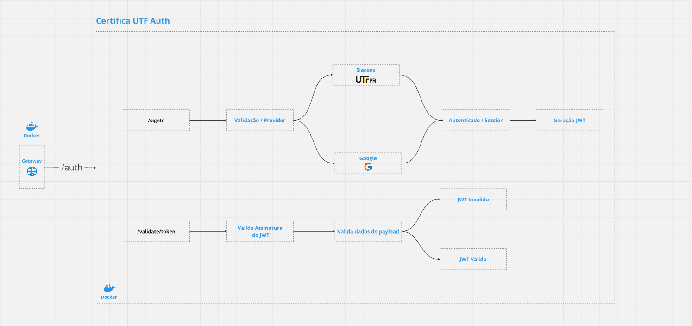

# Certifica UTF Auth

`Projeto voltado a autenticação, hoje possui dois providers, google e seacoes ( Utiliza o registro acadêmico ), com base nos dados do usuário fornecido válida se já existe um usuário cadastrado, se não existir cadastra o usuário automaticamente. Não armazenamos nenhum dado sensível como senha, apenas e-mail e RA para identificação do usuário, dados adicionais necessários sempre são requisitados aos providers.`

## Variaveis de ambiente

|Variavel| Descrição                                                                    |
|:-|:-----------------------------------------------------------------------------|
|`GOOGLE_CLIENT_ID`| **Obrigatório**. Client ID utilizado para integração com o google oauth      |
|`MONGO_URL`| **Obrigatório**. URL do mongoDB atlas                                        |
|`TOKEN_SECURITY_JWT`| **Obrigatório**. Palavra utilizada para assinar o JTW                        |
|`UTFPR_BASEURL`| **Obrigatório**. Host do Seacoes para login com o sistema acadêmico da UTFPR |

## Fluxograma

